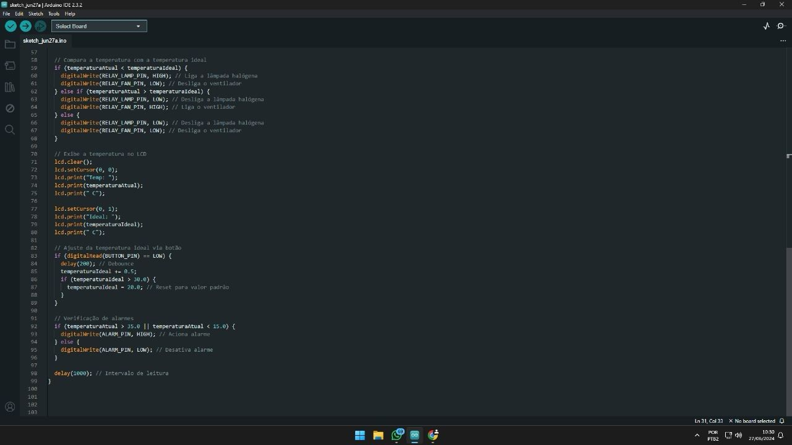

# 🌡️ Monitor de Temperatura com Arduino

Este projeto consiste em um monitor de temperatura utilizando **Arduino UNO**, **sensor LM35** e um **display LCD 16x2**, com auxílio de um **potenciômetro** para controle de contraste.

## 📷 Imagem do Projeto

## 🧰 Componentes Utilizados

- 1x Arduino UNO
- 1x Display LCD 16x2
- 1x Sensor de temperatura LM35
- 1x Potenciômetro de 10kΩ (ajuste do contraste do LCD)
- Protoboard e jumpers

## 📌 Esquema de Ligação

- **LCD RS** → Pino 12 do Arduino  
- **LCD E** → Pino 11 do Arduino  
- **LCD D4-D7** → Pinos 5, 4, 3, 2  
- **LM35 Vout** → A0  
- **Potenciômetro**: pino central → V0 do LCD (controle de contraste)

## 🖥️ Funcionamento

O sensor LM35 lê a temperatura ambiente e envia os dados para o Arduino, que calcula e exibe a temperatura em graus Celsius no LCD. O potenciômetro permite ajustar o contraste da tela.

## 🚀 Como usar

1. Faça o upload do código `monitor_temperatura.ino` para seu Arduino UNO.
2. Monte o circuito conforme o esquema.
3. Observe a temperatura sendo exibida em tempo real no LCD.

---

Projeto ideal para aprendizado de sensores analógicos e manipulação de displays com Arduino.
